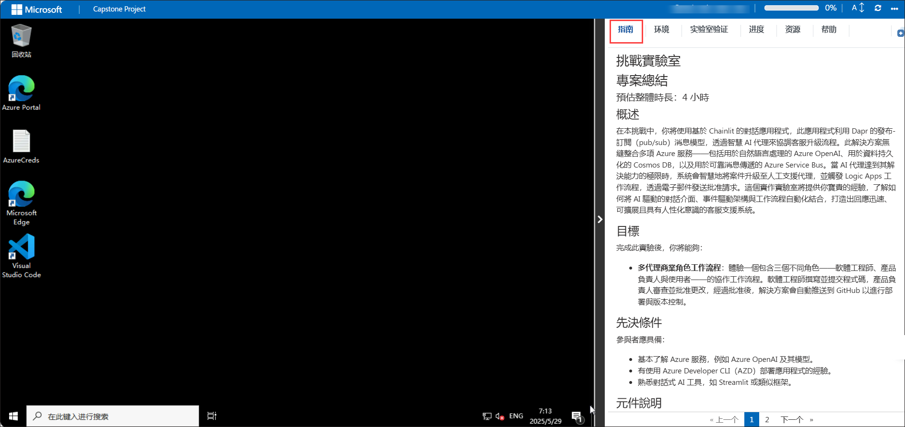
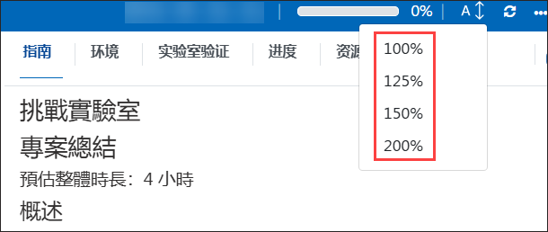
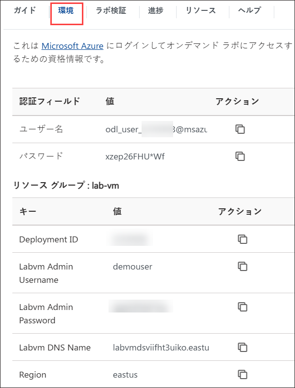
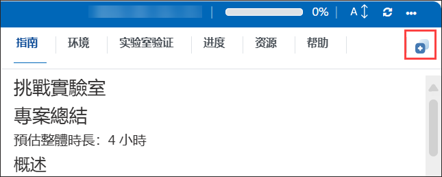
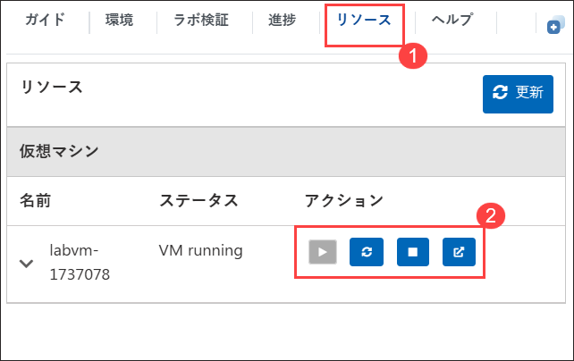
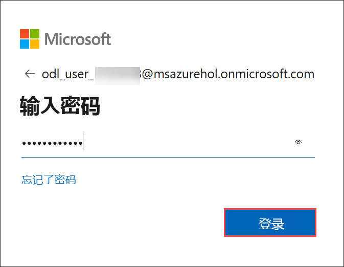
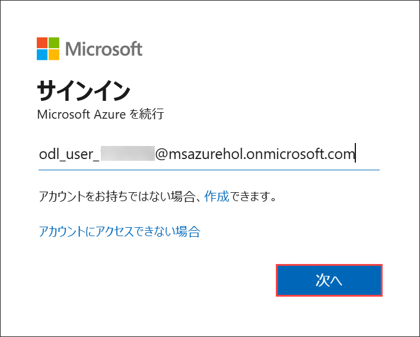
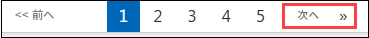

# 챌린지 랩

# 캡스톤 프로젝트

### 전체 예상 소요 시간: 4시간

## 개요

이 챌린지에서는 Dapr의 게시-구독(게시/구독) 메시징 모델을 활용하여 지능형 AI 에이전트를 통해 고객 서비스 에스컬레이션을 오케스트레이션하는 Chainlit 기반 대화형 애플리케이션을 사용합니다. 이 솔루션은 자연어 처리를 위한 Azure OpenAI, 데이터 지속성을 위한 Cosmos DB, 신뢰할 수 있는 메시징을 위한 Azure Service Bus를 비롯한 여러 Azure 서비스를 원활하게 통합합니다. AI 에이전트가 해결 한도에 도달하면 시스템은 이메일을 통해 승인 요청을 보내는 Logic Apps 워크플로를 트리거하여 사례를 인간 지원 에이전트에게 지능적으로 에스컬레이션합니다. 이 핸즈온 랩은 AI 기반 대화형 인터페이스, 이벤트 기반 아키텍처 및 워크플로 자동화를 결합하여 응답성이 뛰어나고 확장 가능하며 인간을 인식하는 고객 지원 시스템을 만드는 방법에 대한 귀중한 통찰력을 제공합니다.

## Objective 

이 실습을 마치면 다음을 수행할 수 있습니다.

- **대화형 지원을 위한 스마트 에스컬레이션 시스템**: Azure OpenAI, Dapr 및 Logic Apps를 사용하여 AI 기반 에스컬레이션 시스템을 설정하고 테스트하여 해결되지 않은 쿼리를 채팅 인터페이스에서 인간 에이전트로 라우팅합니다.

## 필수 구성 요소

참가자는 다음을 갖추어야 합니다:

- Azure OpenAI, Cosmos DB 및 Service Bus와 같은 Azure 서비스에 대한 기본적인 이해.
- Dapr 및 pub/sub 메시징 패턴에 대해 잘 알고 있어야 합니다.
- AZD(Azure Developer CLI)를 사용하여 애플리케이션을 배포한 경험 
- Logic Apps 및 워크플로 자동화에 대한 지식.
- Chainlit 또는 유사한 프레임워크와 같은 대화형 AI 도구에 대한 노출.
- API 및 클라우드 기반 통합 작업에 대한 기본 숙련도..

## 구성 요소 설명

- **Azure AI Foundry**: AI 모델을 개발, 배포 및 관리하기 위한 클라우드 기반 플랫폼입니다. 이를 통해 사용자는 AI 프로젝트를 구성하고, 대규모 언어 모델(LLM)을 배포하고, 임베딩 모델을 통합하여 AI 애플리케이션을 향상시킬 수 있습니다.
- **Azure Cosmos DB**: 고가용성, 짧은 대기 시간 및 확장성을 위해 설계된 전 세계적으로 분산된 다중 모델 NoSQL 데이터베이스 서비스입니다.
- **Azure Service Bus**: 큐 및 토픽을 사용하여 분산 애플리케이션 간에 안정적인 통신을 가능하게 하는 완전 관리형 메시지 브로커입니다.
- **Azure Container Apps**: 인프라를 관리하지 않고 마이크로 서비스 및 컨테이너화된 애플리케이션을 배포하고 확장할 수 있는 서버리스 컨테이너 호스팅 서비스입니다.
- **Azure Logic Apps**: 미리 빌드된 커넥터 및 트리거를 사용하여 앱, 데이터 및 서비스를 통합할 수 있는 클라우드 기반 워크플로 자동화 서비스입니다.

## 실습 시작하기

Azure Agentic AI 워크숍에 오신 것을 환영합니다. 이 환경을 최대한 활용하는 것부터 시작하겠습니다.

## 랩 환경 액세스

시작할 준비가 되면 가상 머신과 랩 가이드가 웹 브라우저 내에서 바로 사용할 수 있습니다.

## 랩 가이드 Zoom In/Zoom Out

환경 페이지의 확대/축소 수준을 조정하려면 랩 환경의 타이머 옆에 있는 A↕: 100% 아이콘을 클릭합니다.

## Virtual Machine & Lab 가이드

가상 머신은 작업장 전체에서 사용할 수 있는 도구입니다. 랩 가이드는 성공을 위한 로드맵입니다.

## 실험실 리소스 탐색

랩 리소스 및 자격 증명을 더 잘 이해하려면 환경 탭으로 이동합니다.

## 분할 창 기능 활용

편의를 위해 오른쪽 위 모서리에서 분할 창 단추를 선택하여 별도의 창에서 랩 가이드를 열 수 있습니다.

## 가상 머신 관리

**Resources (1)** 탭에서 필요에 따라 가상 머신을 **자유롭게 시작, 중지 또는 다시 시작(2)** 할 수 있습니다. 당신의 경험은 당신의 손에 달려 있습니다!

<!-- ## Lab Duration Extension

1. To extend the duration of the lab, kindly click the **Hourglass** icon in the top right corner of the lab environment.

    

    >**Note:** You will get the **Hourglass** icon when 10 minutes are remaining in the lab.

2. Click **OK** to extend your lab duration.

   

3. If you have not extended the duration prior to when the lab is about to end, a pop-up will appear, giving you the option to extend. Click **OK** to proceed. -->

> **메모:** 스크립트가 계속 실행되고 환경에 액세스한 후 종료되지 않았는지 확인하십시오.

## Azure Portal 시작

1. 가상 머신에서 Azure Portal 아이콘을 클릭합니다.
2. Microsoft Azure에 로그인 탭이 표시됩니다. 여기에서 자격 증명을 입력합니다.

   - **이메일/사용자 이름:** <inject key="AzureAdUserEmail"></inject>

     

3. 다음으로 비밀번호를 제공합니다:

   - **암호:** <inject key="AzureAdUserPassword"></inject>

     

4. **작업 필요** 팝업 창이 나타나면 **나중에 확인을** 클릭합니다.
5. **로그인 상태를 유지** 하라는 메시지가 표시되면 **아니요** 를 클릭할 수 있습니다.
6. **Microsoft Azure 시작** 팝업 창이 나타나면 **"취소"** 를 클릭하여 둘러보기를 건너뜁니다.

## "나중에 확인" 옵션이 표시되지 않는 경우 MFA 설정을 진행하는 단계

1. **"추가 정보 필요"** 메시지가 표시되면 **다음**을 선택하세요.

1. **"계정을 안전하게 유지하세요"** 페이지에서 **다음**을 두 번 클릭하세요.

1. **참고:** 모바일 기기에 Microsoft Authenticator 앱이 설치되어 있지 않은 경우:

   - **Google Play 스토어**(Android) 또는 **App Store**(iOS)를 엽니다.
   - **Microsoft Authenticator**를 검색하고 **설치**를 탭하세요.
   - **Microsoft Authenticator** 앱을 열고 **계정 추가**를 선택한 다음 **직장 또는 학교 계정**을 선택하세요.

1. 컴퓨터 화면에 **QR 코드**가 표시됩니다.

1. Authenticator 앱에서 **QR 코드 스캔**을 선택하고 화면에 표시된 코드를 스캔하세요.

1. 스캔을 완료한 후 **다음**을 클릭하여 진행하세요.

1. 휴대폰의 Authenticator 앱에 컴퓨터 화면에 표시된 숫자를 입력하고 **다음**을 선택하세요.

1. 로그인 상태를 유지할지 묻는 메시지가 표시되면 **아니요**를 클릭해도 됩니다.

1. **Microsoft Azure에 오신 것을 환영합니다**라는 팝업 창이 나타나면 **나중에 하기**를 클릭하여 안내를 건너뛰세요.

## 지원 연락처

CloudLabs 지원 팀은 이메일과 라이브 채팅을 통해 연중무휴 24/7 365일 언제든지 원활한 지원을 받을 수 있습니다. 학습자와 강사 모두를 위해 특별히 맞춤화된 전용 지원 채널을 제공하여 모든 요구 사항을 신속하고 효율적으로 해결할 수 있도록 합니다.

학습자 지원 연락처:

- 이메일 지원: [cloudlabs-support@spektrasystems.com](mailto:cloudlabs-support@spektrasystems.com)
- 라이브 채팅 지원: https://cloudlabs.ai/labs-support

오른쪽 아래 모서리에서 다음을 클릭하여 실습 여정을 시작하세요!

이제 강력한 기술 세계를 탐험할 준비가 되었습니다. 도중에 질문이 있는 경우 언제든지 문의하십시오. 워크샵을 즐기십시오!
