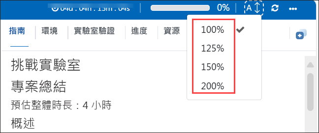
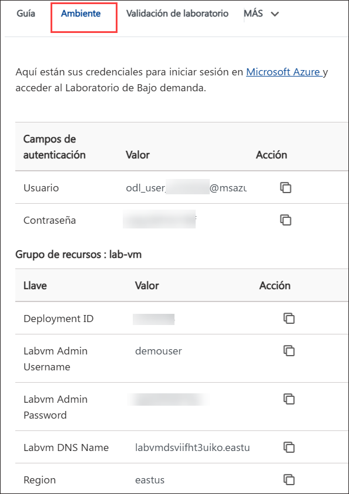
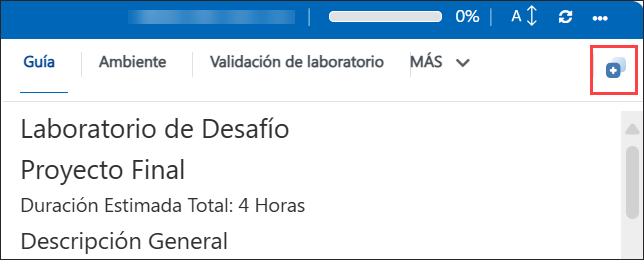
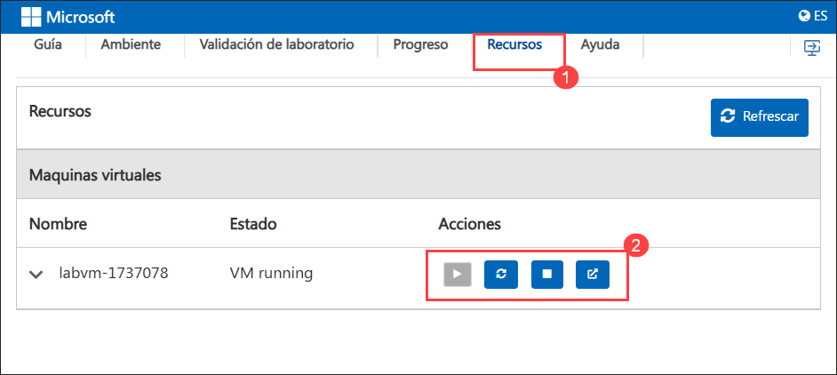
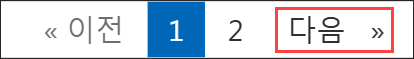

# Laboratorio de Desafío

# Proyecto Final

### Duración Estimada Total: 4 Horas

## Descripción General

En este desafío, trabajarás con una aplicación conversacional basada en Chainlit que utiliza el modelo de mensajería de publicación-suscripción (pub/sub) de Dapr para orquestar las escaladas de atención al cliente mediante agentes inteligentes de IA. La solución integra sin problemas varios servicios de Azure —incluyendo Azure OpenAI para procesamiento de lenguaje natural, Cosmos DB para persistencia de datos y Azure Service Bus para mensajería confiable. Cuando los agentes de IA alcanzan sus límites de resolución, el sistema escala de forma inteligente el caso a un agente de soporte humano, activando un flujo de trabajo de Logic Apps que envía una solicitud de aprobación por correo electrónico. Este laboratorio práctico ofrece una valiosa visión sobre cómo las interfaces conversacionales impulsadas por IA, la arquitectura orientada a eventos y la automatización de flujos de trabajo pueden combinarse para crear sistemas de soporte al cliente receptivos, escalables y conscientes del factor humano.

## Objetivo

Al finalizar este laboratorio, podrás:

- **Flujo de Trabajo de Persona Empresarial Multi-Agente**: Experimentar un flujo de trabajo colaborativo que involucra tres personas distintas: Software Engineer, Product Owner y User. El Software Engineer escribe y envía código, el Product Owner revisa y aprueba los cambios, y tras la aprobación, la solución se envía automáticamente a GitHub para su despliegue y control de versiones.

## Requisitos Previos

Los participantes deben tener:

- Comprensión básica de los servicios de Azure, como Azure OpenAI y los modelos.
- Experiencia desplegando aplicaciones utilizando Azure Developer CLI (`AZD`).
- Conocimiento de herramientas de IA conversacional como Streamlit o frameworks similares.

## Explicación de los Componentes

- **Azure OpenAI**: Un servicio basado en la nube que proporciona acceso a modelos de lenguaje avanzados, permitiendo procesamiento de lenguaje natural, generación de contenido y capacidades de IA conversacional. Permite integrar potentes funciones impulsadas por IA en tus aplicaciones de manera segura y a escala.
- **Azure Container Apps**: Un servicio de alojamiento de contenedores sin servidor que permite implementar y escalar microservicios y aplicaciones contenerizadas sin necesidad de administrar la infraestructura.

## Comenzando con el laboratorio

Bienvenido a tu Azure Agentic AI Workshop. Comencemos aprovechando al máximo esta experiencia:

## Accediendo a tu Entorno de Laboratorio

Una vez que estés listo para empezar, tu máquina virtual y la **lab guide** estarán a tu alcance desde tu navegador web.

## Lab Guide Zoom In/Zoom Out

Para ajustar el nivel de zoom de la página del entorno, haz clic en el icono **A↕ : 100%** ubicado junto al temporizador en el entorno del laboratorio.

## Virtual Machine & Lab Guide

Tu máquina virtual es tu herramienta de trabajo durante todo el workshop. La **lab guide** es tu hoja de ruta hacia el éxito.

## Explorando Tus Recursos de Laboratorio

Para entender mejor tus recursos y credenciales del laboratorio, navega a la pestaña **Environment**.

## Utilizando la Función de Ventana Dividida

Para mayor comodidad, puedes abrir la **lab guide** en una ventana separada seleccionando el botón **Split Window** en la esquina superior derecha.

## Gestión de Tu Máquina Virtual

Siéntete libre de **start, stop, or restart (2)** tu máquina virtual según sea necesario desde la pestaña **Resources (1)**. ¡Tu experiencia está en tus manos!

<!-- ## Extensión de la Duración del Laboratorio

1. Para extender la duración del laboratorio, haz clic en el icono **Hourglass** en la esquina superior derecha del entorno del laboratorio.

    

    >**Nota:** El icono **Hourglass** aparecerá cuando queden 10 minutos del laboratorio.

2. Haz clic en **OK** para extender la duración del laboratorio.

   

3. Si no has extendido la duración antes de que el laboratorio esté por finalizar, aparecerá una ventana emergente con la opción de extender. Haz clic en **OK** para continuar. -->

> **Nota:** Por favor asegúrate de que el script siga ejecutándose y no sea terminado después de acceder al entorno.

## Comencemos con el Azure Portal

1. En tu máquina virtual, haz clic en el ícono de Azure Portal.
2. Verás la pestaña **Sign into Microsoft Azure**. Aquí, ingresa tus credenciales:

   - **Email/Username:** <inject key="AzureAdUserEmail"></inject>

     

3. Luego, proporciona tu contraseña:

   - **Password:** <inject key="AzureAdUserPassword"></inject>

     

4. Si aparece una ventana emergente de **Action required**, haz clic en **Ask later**.
5. Si te preguntan si deseas **stay signed in**, puedes hacer clic en **No**.
6. Si aparece una ventana emergente de **Welcome to Microsoft Azure**, simplemente haz clic en **"Cancel"** para saltarte el recorrido.

## Pasos para continuar con la configuración de MFA si la opción "Ask Later" no está visible

1. En el aviso **"More information required"**, selecciona **Next**.

2. En la página **"Keep your account secure"**, selecciona **Next** dos veces.

3. **Nota:** Si no tienes la aplicación Microsoft Authenticator instalada en tu dispositivo móvil:

   - Abre **Google Play Store** (Android) o **App Store** (iOS).
   - Busca **Microsoft Authenticator** y toca **Install**.
   - Abre la aplicación **Microsoft Authenticator**, selecciona **Add account**, luego elige **Work or school account**.

4. Se mostrará un **QR code** en la pantalla de tu computadora.

5. En la aplicación Authenticator, selecciona **Scan a QR code** y escanea el código que aparece en tu pantalla.

6. Después de escanear, haz clic en **Next** para continuar.

7. En tu teléfono, ingresa el número que se muestra en la pantalla de tu computadora dentro de la aplicación Authenticator y selecciona **Next**.

8. Si te preguntan si deseas mantener la sesión iniciada, puedes hacer clic en "No".

9. Si aparece una ventana emergente de **Welcome to Microsoft Azure**, simplemente haz clic en "Maybe Later" para saltarte el recorrido.

## Contacto de Soporte

El equipo de soporte de CloudLabs está disponible 24/7, 365 días al año, vía correo electrónico y chat en vivo para garantizar asistencia continua en cualquier momento. Ofrecemos canales de soporte dedicados, diseñados específicamente para estudiantes e instructores, asegurando que todas tus necesidades sean atendidas de manera rápida y eficiente.

Contactos de soporte para estudiantes:

- Soporte por correo electrónico: [cloudlabs-support@spektrasystems.com](mailto:cloudlabs-support@spektrasystems.com)
- Soporte por chat en vivo: https://cloudlabs.ai/labs-support

Haz clic en **Next** en la esquina inferior derecha para comenzar tu recorrido en el Lab.

Ahora estás listo para explorar el poderoso mundo de la tecnología. No dudes en comunicarte si tienes alguna pregunta en el camino. ¡Disfruta tu taller!
