## Solution Guide
# Multi-Agent Systems - Solution Guide

## Introduction

Multi-Agent Systems (MAS) consist of multiple autonomous agents, each with distinct goals, behaviors, and areas of responsibility. These agents can interact with each other, either cooperating or competing, depending on the objectives they are designed to achieve. In MAS, each agent operates independently, making decisions based on its local knowledge and the environment, but they can communicate and share information to solve complex problems collectively.

MAS is often used in scenarios where tasks are distributed across different entities, and the overall system benefits from decentralization. Examples include simulations of real-world systems like traffic management, robotic teams, distributed AI applications, or networked systems where agents need to coordinate actions without a central controller. MAS allows for flexibility, scalability, and adaptability in solving dynamic and complex problems where a single agent or centralized system might be less efficient or incapable of handling the complexity on its own.

In this challenge, you will create a multi-agent system that takes the user's request and feeds it to a collection of agents. Each agent will have its own persona and responsibility. The final response will be a collection of answers from all agents that together will satisfy the user's request based on each persona's area of expertise.

## Task 1 - Azure AI Foundry Model Deployment & Environment Configuration

1. Navigate to `https://portal.azure.com` and log in with your Azure credentials.

    - **Email/Username**: <inject key="AzureAdUserEmail"></inject>
    - **Password**: <inject key="AzureAdUserPassword"></inject>

1. Search and Select Open AI. 

   

1. On the **Azure Open AI (1)** content page, click on **+ create(2)**.

   

1. Provide the following details and click on **Next**:

    - Subscription: Keep the default subscription **(1)**.

    - Resource Group: Click on Create new (2), provide the name as **openaiagents** and click on OK.

    - Region: East US 2 (3)

    - Name: **OpenAI-<inject key="Deployment ID" enableCopy="false"/>** (4)

    - Pricing Tier: Standard (5)

   

1. Click on Next twice and click on **Review + Submit**.

1. Review all the values and click on **Create**.

1. Once the deployment is complete, click on **Go to resource**

1. In the Azure OpenAI resource pane, click on Go to Azure AI Foundry portal, it will navaigate to Azure AI Foundry portal.

   

1. On the left panel select **Deployments**. Click on **+ Deploy Model** and select **Deploy Base Model**.

   

1. Search for **gpt-4o**, select it and click on **Confirm**.

   

1. Click on **Customize** and provide the following details to deploy a gpt-4o model:

    - Deployment name: **gpt4-o (1)**
    - Deployment type: **Global Standard (2)**
    - Model Version: **2024-11-20 (3)**
    - Set the **Tokens per Minute Rate Limit** to **200k (4)**.
    - Leave the other values to default and click on **Deploy (5)**.

   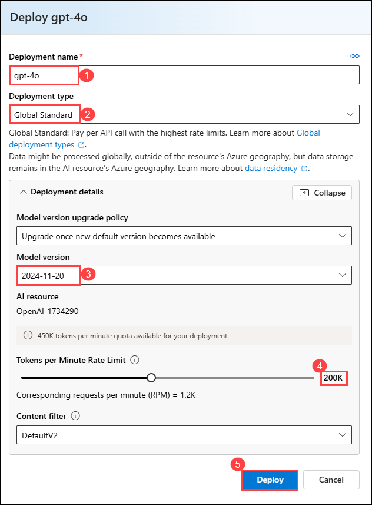

1. Once the gpt-4o deployment gets completed, copy the **Target URI** and **Key**. **Paste** these values in a notepad for further use. 

   

1. Open VS Code from the desktop. Click on **File** and select **Open Folder**.

   

1. Navigate to the path `C:\LabFiles\`, select **Capstone-Project** and click on **Select Folder**.

   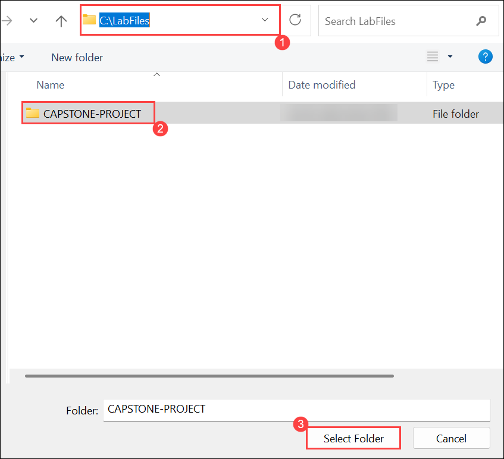

1. Select the **checkbox** and click **'I trust the authors'** to proceed.

   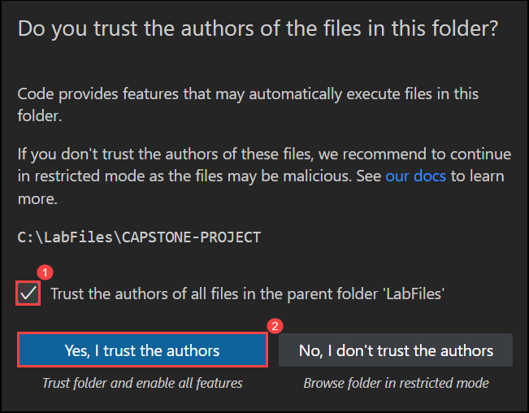

1. Expand the src folder, rename the file from **Sample.env** to **.env**.

   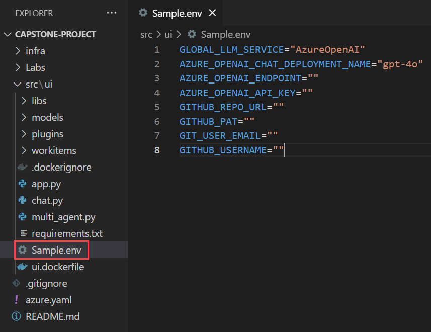

1. Update the `.env` file with the Azure AI Foundry deployment details and save the file:

    ```
    AZURE_OPENAI_CHAT_DEPLOYMENT_NAME=Replace with your deployment name
    AZURE_OPENAI_ENDPOINT=Replace with your endpoint URL
    AZURE_OPENAI_API_KEY=Replace with your API key
    ```
   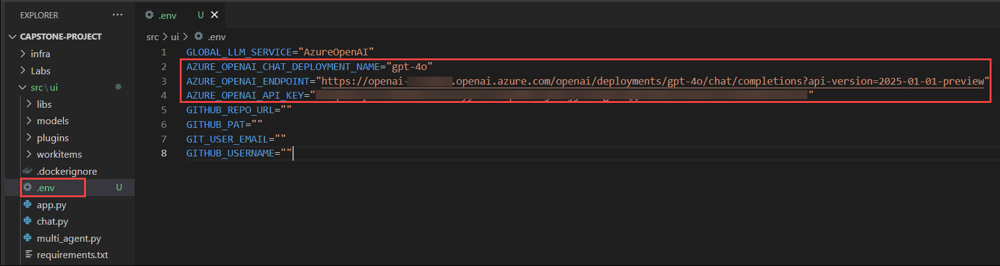

## Task 2 - Create a GitHub Repository and Generate a PAT Token

1. Sign in to GitHub at [https://github.com](https://github.com).  

1. Create a New Repository with the name `Capstone-Project-<inject key="Deployment ID" enableCopy="false"/>` **(1)**. Let the repo be set to **Public (2)** and click on **Create Repository (3)**.

   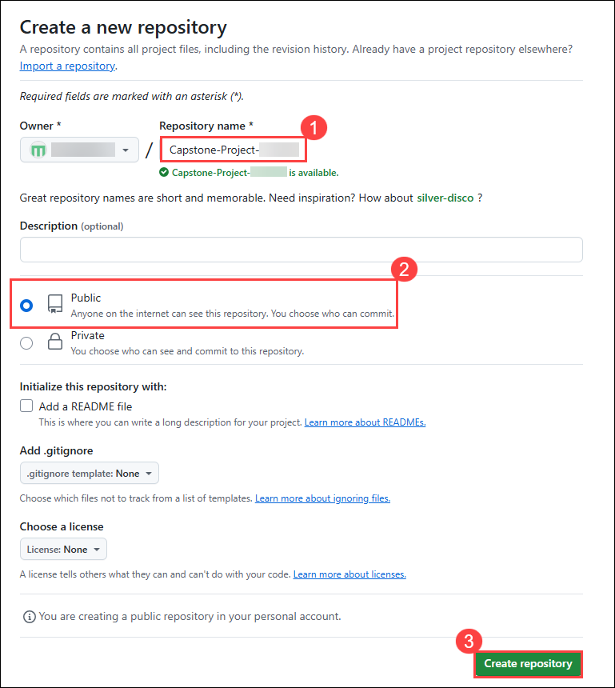

1. Once the new Repository gets created, **copy the URL** of your repo and paste it in a notepad for further use. 

   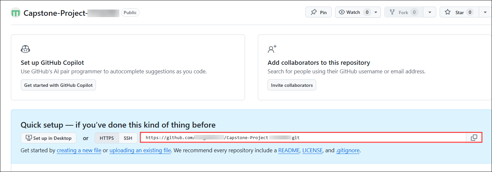

1. Click your **profile picture (1)** at the top-right corner and select **Settings (2)** from the dropdown menu.  

   

1. In the left sidebar, click **<> Developer settings**.  

   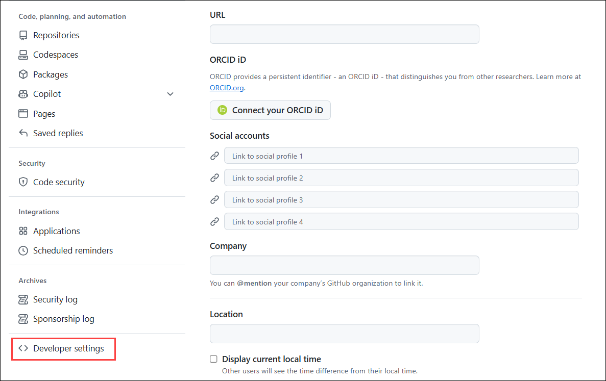

1. Expand **Personal access tokens** from the left panel. Select **Fine-grained tokens(1)** and click on **Generate new token (2)**.

   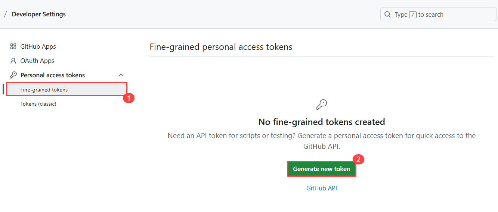
  
1. Enter `<inject key="Deployment ID" enableCopy="false"/>-PAT-RepoAccess` **(1)** as the name for your token. Set an expiration date to **30 days (2)**.  

   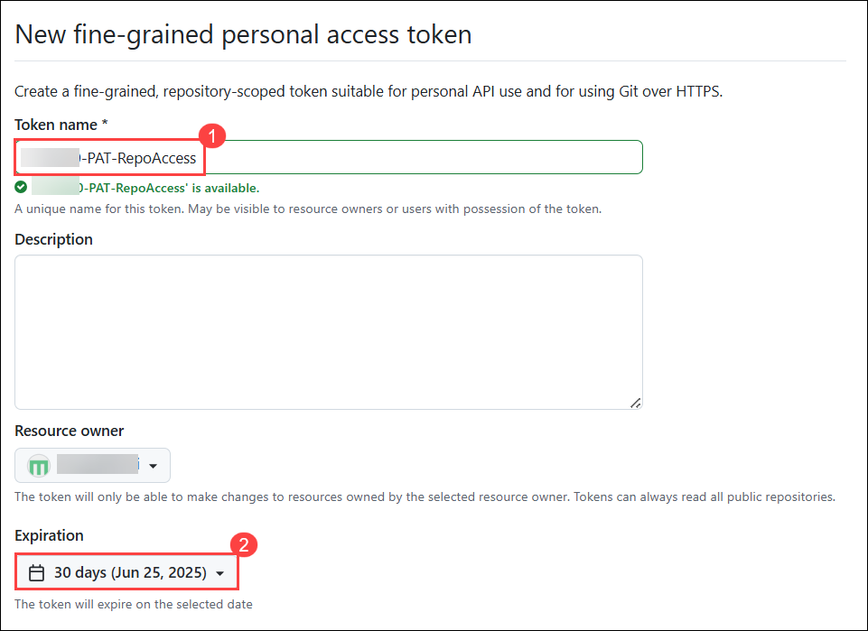

1. Scroll down and under **Repository Access**, click on **Only select repositories (1)**. Search for `Capstone-Project-<inject key="Deployment ID" enableCopy="false"/>` **(2)** Repository and **select it (3)**.

   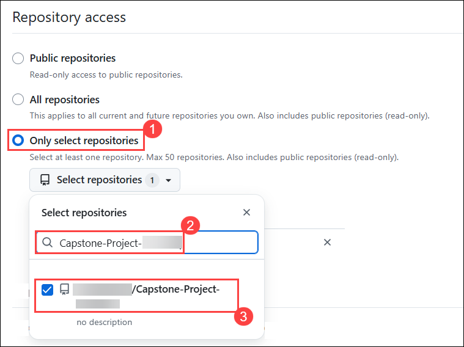  

1. Under **Permissions**, expand **Repository Permissions (1)**. Provide **Read and Write (3)** access for **Contents (2)** under Repository permissions.

   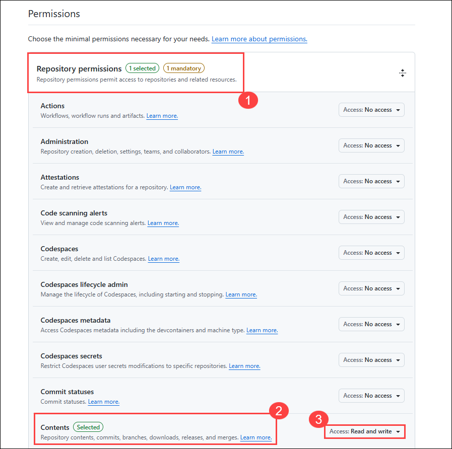  

1. Scroll down to the bottom of the page, click on **Generate token (1)** and on the pop up review the permissions and click on **Generate token (2)**.

   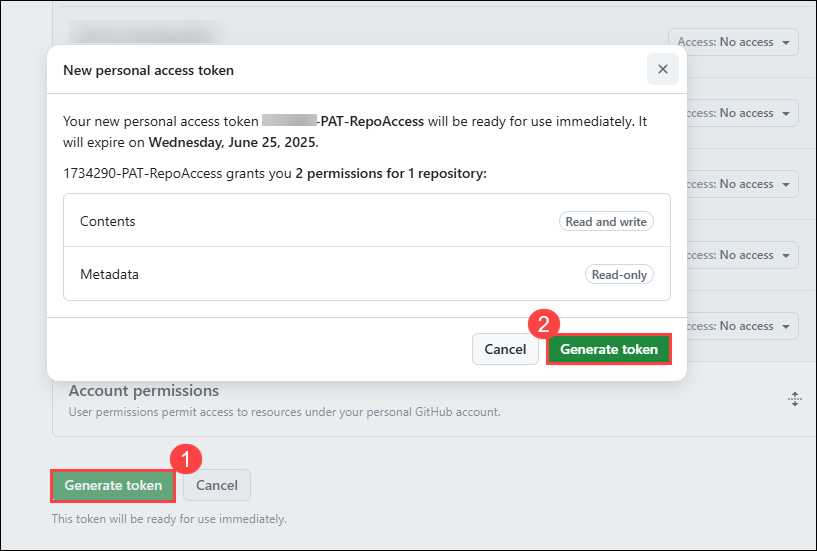  

1. **Copy (1)** the generated token and **Paste** it in a notepad for further use.  

   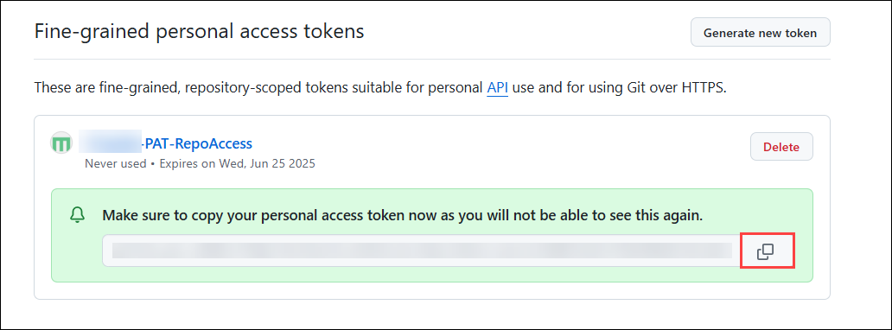
   
## Task 3 - Define Agent Personas and Configure Multi-Agent Chat

1. Open the `multi_agent.py` file. This is where you will implement all necessary code for this challenge.
   
1. Replace the code in the **multi_agent.py** file with code from the below link and save.
    ```
    https://docs-api.cloudlabs.ai/repos/raw.githubusercontent.com/CloudLabsAI-Azure/Capstone-Project/refs/heads/soln-guide/src/ui/multi_agent.py
    ```

    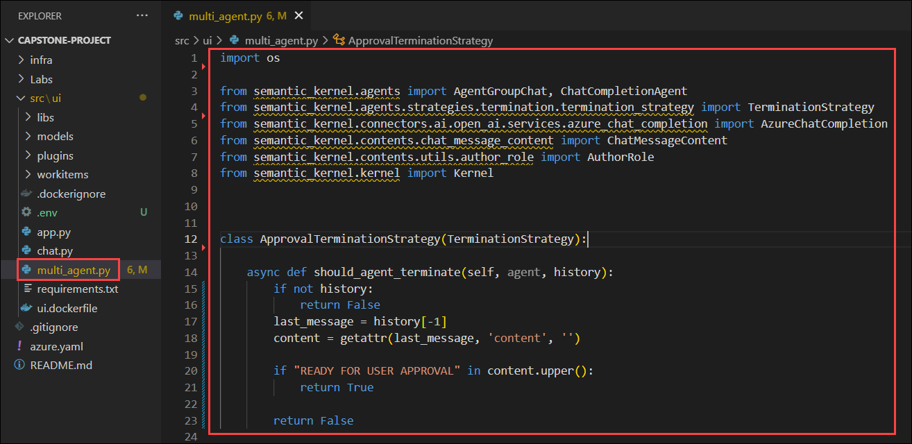


1. Create a file named `push_to_github.sh` under the `src/ui` directory and paste the code from below link and save.

    ```
    https://docs-api.cloudlabs.ai/repos/raw.githubusercontent.com/CloudLabsAI-Azure/Capstone-Project/refs/heads/soln-guide/src/ui/push_to_github.sh
    ```

    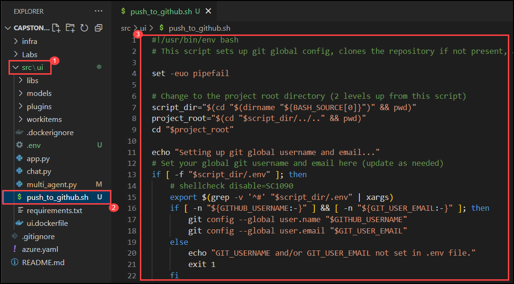

1. Update the following env variables in `.env` file with the values you copied in Task 2 and save the file.
    ```
    GITHUB_REPO_URL=Replace with your Github Repo
    GITHUB_PAT=Replace with your Github pat token
    GIT_USER_EMAIL=Replace with your Github email
    GITHUB_USERNAME=Replace with your Github username
    ```
    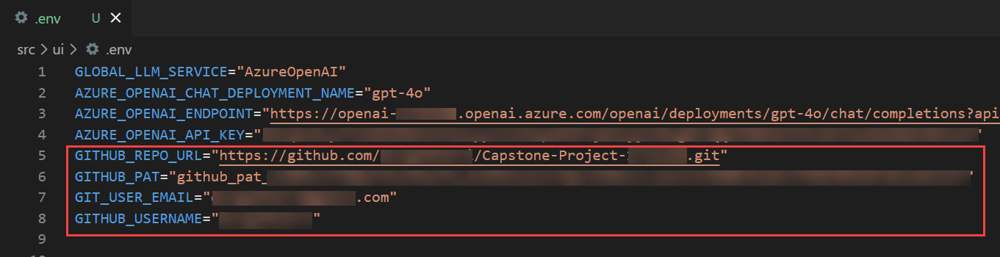


1. Click on the **ellipses(1)**. Select **Terminal(2)** and choose **New Terminal(3)**.

    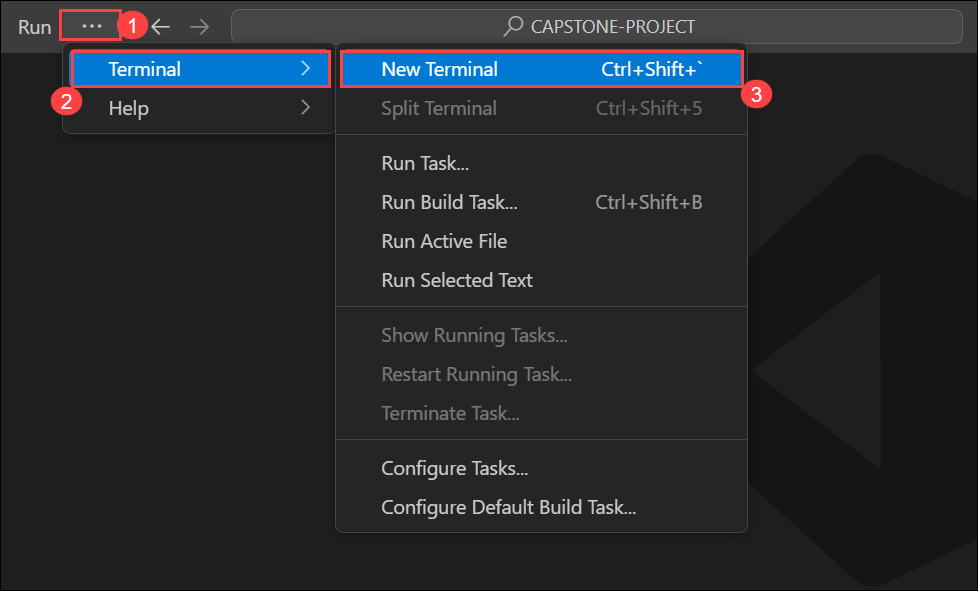

1.  Run the following command:-

    ```
    azd auth login
    ```

    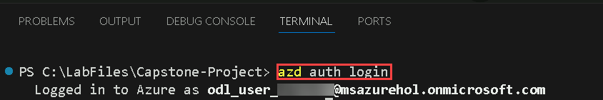

1. Sign in using the following credentials:-
    - **Email/Username**: <inject key="AzureAdUserEmail"></inject>
    - **Password**: <inject key="AzureAdUserPassword"></inject>

1. Run the following command to provision the web app and required resources to azure:-

    ```
    azd up
    ```
1. When prompted for a unique Environment name, enter `CapstoneEnv<inject key="Deployment ID" enableCopy="false"/>` **(1)**. For Subscription, select and enter the **default subscription (2)** that appears and select **East US 2 (3)** for the location.

    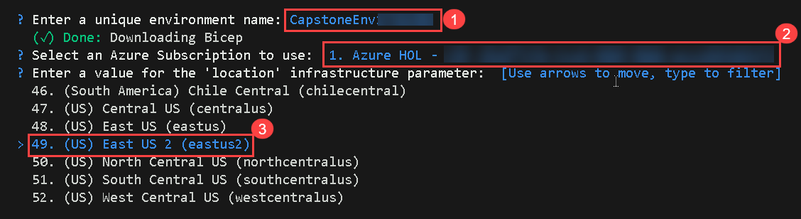

   - **Note:** Wait for 5 minutes until the command runs completely. 

## Task 4 - 

1. Navigate to azure portal, and select the newly created Resource group named **rg-CapstoneEnv<inject key="Deployment ID" enableCopy="false"/>**.

1. Open the container app with prefix **dev-ui-**.

    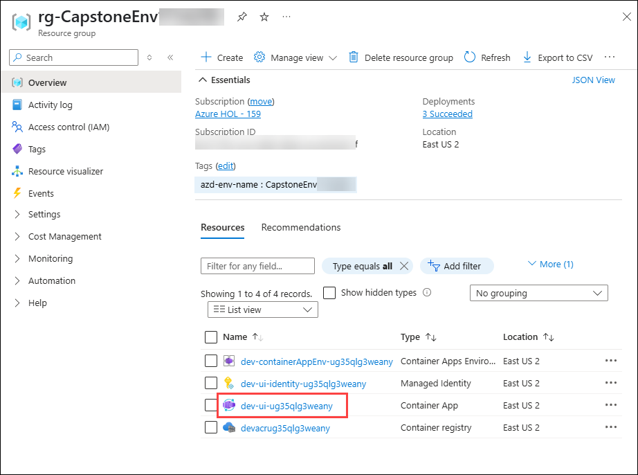

1. Click on the Application URL present on the Overview page of the Container app.

    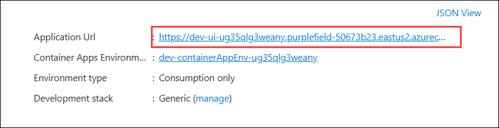

1. The Streamlit chat application will open. Try providing the **below prompt (1)** in the chat and click on **send**.

    ```
    Create code for simple calculator
    ```
   - **Note:** Wait until the agents are collaborating and provide a reply.

    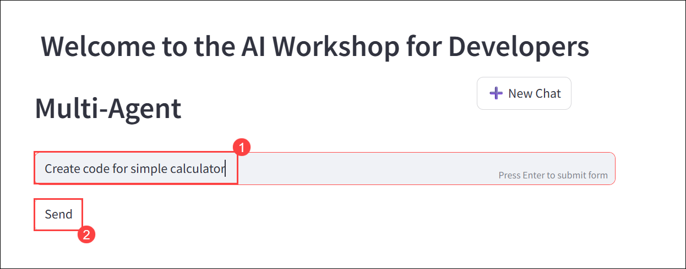

1. Once it runs and provides the code and other details, type **approved (1)** and select **send (2)** to approve the code. At the end of the chat, you can observe that the code is being pushed to the repo after approval. 

    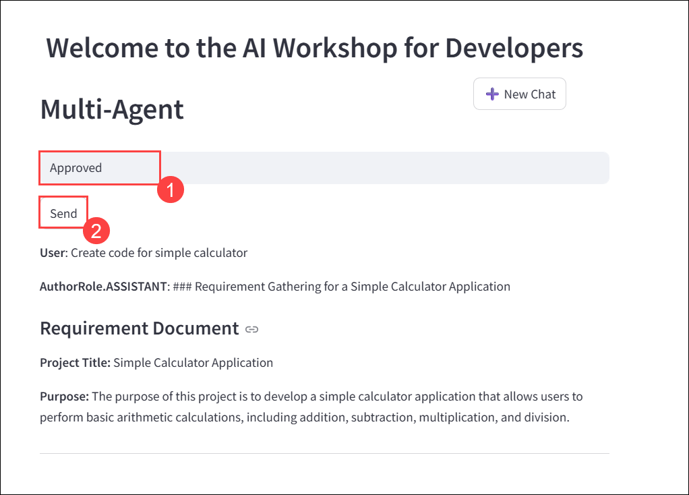

    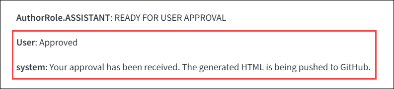

1. Navigate to the Repo **Capstone-Project-<inject key="Deployment ID" enableCopy="false"/>**, and observe that the generated_app.html file is created in which the code for you simple calculator is stored.

    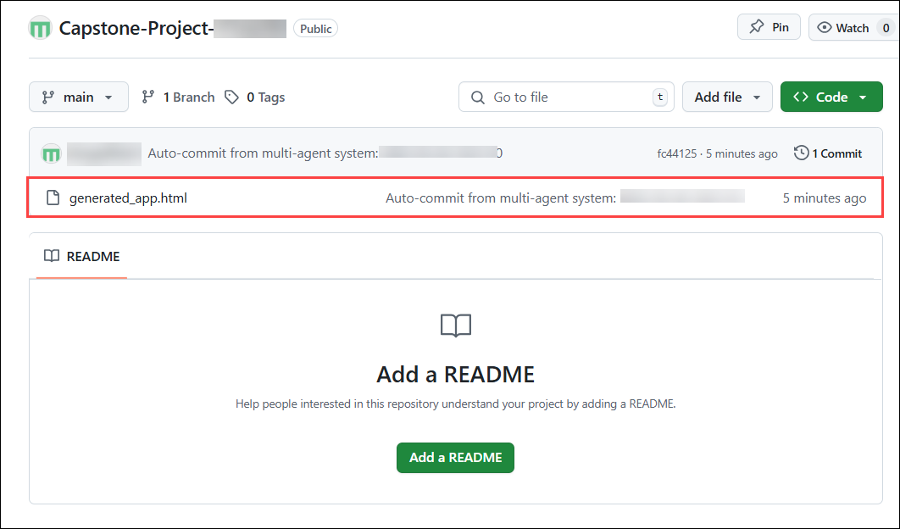

## Success Criteria

- You have implemented the Multi-Agent Chat system that produces:
    - Generation of complete source code in HTML and JavaScript for the requested application
    - Thorough code review and approval process by User
    - Automated deployment of the application to Azure
    - Automated code push to a Git repository upon user approval

---

## Bonus

- Copy the code from the chat history markdown into matching files on your file system.
- Save HTML content as `index.html` and launch it in your web browser.
- Test if the application functions as the AI described.
- Enhance the app by asking the AI to make it responsive or add new features.
- Experiment with modifying personas to improve results or functionality.

---

## Learning Resources

- [Agent Group Chat with Semantic Kernel](https://learn.microsoft.com/en-us/semantic-kernel/frameworks/agent/agent-chat?pivots=programming-language-python)
- [MetaGPT](https://github.com/geekan/MetaGPT)
- [AutoGen Multi-Agent Conversational Framework](https://microsoft.github.io/autogen/docs/Use-Cases/agent_chat/)
- [AutoGen with Semantic Kernel](https://devblogs.microsoft.com/semantic-kernel/autogen-agents-meet-semantic-kernel/)

---

## Conclusion

This challenge demonstrated how to build and coordinate a Multi-Agent System using Azure AI Foundry and Semantic Kernel. By designing distinct personas for Business Analyst, Software Engineer, and Product Owner, and configuring a group chat environment with a termination strategy, you created a collaborative AI workflow capable of gathering requirements, developing code, and performing code reviews. The task structure allows for scalable, decentralized handling of complex problems using autonomous, interactive agents.
