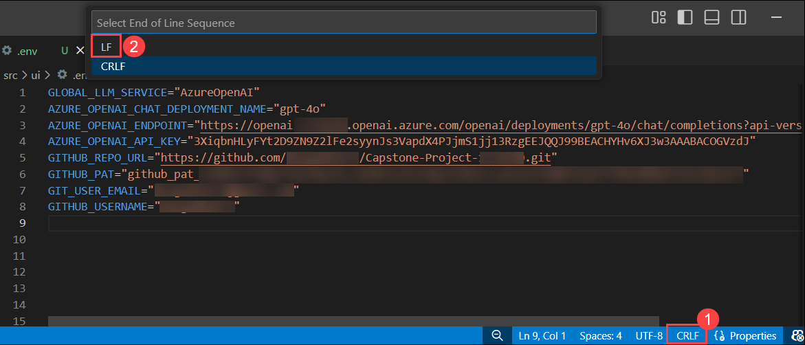
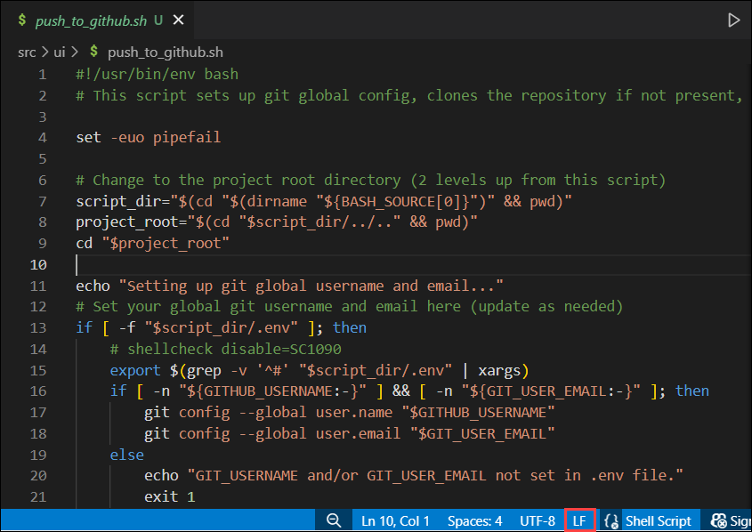
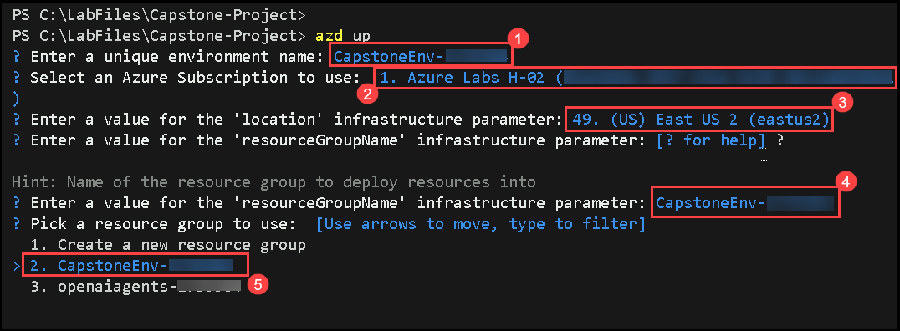

## ソリューションガイド
# マルチエージェントシステム - ソリューションガイド

## はじめに

マルチエージェントシステム(MAS)は、それぞれが異なる目標、動作、および責任範囲を持つ複数の自律エージェントで構成されています。これらのエージェントは独立して動作し、地域の知識と環境に基づいて意思決定を行います。しかし、彼らはまた、彼らの目的に応じて協力したり競争したりして、互いにコミュニケーションを取り、情報を共有することもできます。MAS は通常、タスクが複数のエンティティに分散され、システムが分散化の恩恵を受けるシナリオで使用されます。一般的なアプリケーションには、トラフィック管理、ロボットチーム、分散型AI、中央コントローラーに依存しない調整が必要なネットワークシステムなどがあります。

この課題では、ユーザーのリクエストを受け入れ、それぞれが特定のペルソナと専門分野で設計されたエージェントのコレクションを通じて処理するマルチエージェントシステムを作成します。エージェントは個別にリクエストを分析し、定義された責任に基づいて応答を提供します。最終的な出力は、すべてのエージェントからの回答の統合コレクションであり、各ペルソナの独自の視点を反映する方法でユーザーのクエリに協力して対処します。

## タスク 1 - Azure AI Foundry モデルのデプロイと環境構成

1. `https://portal.azure.com` にアクセスし、Azure の資格情報でログインします。

    - **Email/Username**: <inject key="AzureAdUserEmail"></inject>
    - **Password**: <inject key="AzureAdUserPassword"></inject>

1. `Open AI` を検索して選択します。

   

1. **Azure Open AI (1)** のコンテンツページで、**+ create(2)** をクリックします。

   


1. 次の詳細を入力し、**Next** をクリックします。

    - Subscription: デフォルトのサブスクリプションをそのまま使用 **(1)**。

    - Resource Group: **Create new (2)** をクリックし、名前に **openaiagents** と入力して OK をクリック。

    - Region: **East US 2 (3)**

    - Name: **OpenAI-<inject key="Deployment ID" enableCopy="false"/>** **(4)**

    - Pricing Tier: **Standard SO (5)**

   

1. **Next** を2回クリックし、**Review + Submit** をクリックします。

1. すべての値を確認し、**Create** をクリックします。

1. デプロイが完了したら、**Go to resource** をクリックします。

1. Azure OpenAI リソースペインで **Go to Azure AI Foundry portal** をクリックすると、Azure AI Foundry ポータルに移動します。

   

1. 左側のパネルで **Deployments (1)** を選択します。**+ Deploy Model (2)** をクリックし、**Deploy Base Model (3)** を選択します。

   

1. **gpt-4o (1)** を検索し、**選択 (2)** して、**Confirm (3)** をクリックします。

   

1. **Customize** をクリックし、次の詳細を入力して gpt-4o モデルをデプロイします。

    - Deployment name: **gpt4-o (1)**
    - Deployment type: **Global Standard (2)**
    - Model Version: **2024-11-20 (3)**
    - **Tokens per Minute Rate Limit** を **200k (4)** に設定します。
    - その他の値はデフォルトのままにし、**Deploy (5)** をクリックします。

   

1. gpt-4o のデプロイが完了したら、**Target URI (1)** と **Key (2)** をコピーします。これらの値をメモ帳などに **Paste** して、後で使用できるようにしておきます。

   

1. Lab VM 上で VS Code を開きます。**File (1)** をクリックし、**Open Folder (2)** を選択します。

   

1. パス `C:\LabFiles\` **(1)** に移動し、**CAPSTONE-PROJECT (2)** を選択して **Select Folder (3)** をクリックします。

   

1. **チェックボックス (1)** を選択し、**Yes, I trust the authors (2)** をクリックして進みます。

   

1. **src/ui** フォルダーを展開し、ファイル名を **Sample.env** から **.env** に変更します。

   

1. `.env` ファイルを開き、Azure AI Foundry デプロイメントの詳細を以下のように更新して保存します。

    ```
    AZURE_OPENAI_CHAT_DEPLOYMENT_NAME=Replace with your deployment name
    AZURE_OPENAI_ENDPOINT=Replace with your endpoint URL
    AZURE_OPENAI_API_KEY=Replace with your API key
    ```
   

## タスク 2 - GitHub リポジトリの作成と PAT トークンの生成

1. [https://github.com](https://github.com) にサインインします。

1. 新しいリポジトリを作成し、名前を **Capstone-Project-<inject key="Deployment ID" enableCopy="false"/>** **(1)** に設定します。リポジトリの公開範囲を **Public (2)** にし、**Create Repository (3)** をクリックします。

   

1. 新しいリポジトリが作成されたら、**リポジトリの URL をコピー**し、メモ帳などに貼り付けて後で使用できるようにします。

   

1. 画面右上の **プロフィール画像 (1)** をクリックし、ドロップダウンメニューから **Settings (2)** を選択します。

   


1. 左側のサイドバーで **<> Developer settings** をクリックします。

   

1. 左側のパネルで **Personal access tokens** を展開し、**Fine-grained tokens (1)** を選択して、**Generate new token (2)** をクリックします。

   

1. トークンの名前として **<inject key="Deployment ID" enableCopy="false"/>-PAT-RepoAccess** **(1)** を入力し、有効期限を **30 days (2)** に設定します。

   

1. 下にスクロールし、**Repository Access** のセクションで、**Only select repositories (1)** をクリックします。**Capstone-Project-<inject key="Deployment ID" enableCopy="false"/> repository** **(2)** を検索し、**選択 (3)** します。

   

1. **Permissions** セクションで **Repository Permissions (1)** を展開します。**Repository permissions** 内の **Contents (2)** に対して **Read and Write (3)** のアクセス権を付与します。

   

1. ページの一番下までスクロールし、**Generate token (1)** をクリックします。ポップアップで権限を確認し、**Generate token (2)** をクリックします。

   

1. 作成されたトークンを **Copy (1)** し、メモ帳などに **paste** して、後で使用できるようにします。

   

## タスク 3 - エージェントペルソナの定義とマルチエージェントチャットの構成

1. `multi_agent.py` ファイルを開きます。このファイルで、このチャレンジに必要なコードをすべて実装します。

1. **multi_agent.py** ファイル内のコードを以下のリンク先のコードに置き換え、ファイルを保存します。

    ```
    https://docs-api.cloudlabs.ai/repos/raw.githubusercontent.com/CloudLabsAI-Azure/Capstone-Project/refs/heads/soln-guide/src/ui/multi_agent.py
    ```

    

1. `src/ui` ディレクトリ内に `push_to_github.sh` という名前のファイルを作成します。以下のリンク先のコードを貼り付け、ファイルを保存します。

    ```
    https://docs-api.cloudlabs.ai/repos/raw.githubusercontent.com/CloudLabsAI-Azure/Capstone-Project/refs/heads/soln-guide/src/ui/push_to_github.sh
    ```

    

1. `.env` ファイル内の以下の環境変数を、タスク 2 でコピーした値で更新し、ファイルを保存します。

    ```
    GITHUB_REPO_URL=Replace with your Github Repo
    GITHUB_PAT=Replace with your Github pat token
    GIT_USER_EMAIL=Replace with your Github email
    GITHUB_USERNAME=Replace with your Github username
    ```
    


1. `.env` ファイルの下部ステータスバーで **CRLF (1)** をクリックし、**LF (2)** に変更します。変更後、ファイルを保存します。

    

1. `push_to_github.sh` ファイルでも **LF** が選択されていることを確認します。

    

1. **・・・（ellipsis）(1)** をクリックし、**Terminal (2)** を選択してから **New Terminal (3)** を選びます。

    

1. 以下のコマンドを実行します。

    ```
    azd auth login
    ```

    

1. 次の資格情報を使用してサインインします。

    - **Email/Username**: <inject key="AzureAdUserEmail"></inject>
    - **Password**: <inject key="AzureAdUserPassword"></inject>

1. 次のコマンドを実行して、Web アプリおよび必要なリソースを Azure にプロビジョニングします。

    ```
    azd up
    ```

1. **azd up** コマンド実行中に対話形式で構成情報の入力を求められます。以下の値を入力してください。

   - **Unique Environment Name**: **CapstoneEnv-<inject key="Deployment ID" enableCopy="false"/>** **(1)** と入力します。
   - **Azure Subscription to use**: 表示されるデフォルトのサブスクリプション **(2)** を選択して **Enter** キーを押します。
   - **Location Infrastructure Parameter**: オプションから **East US 2** **(3)** を選択して **Enter** キーを押します。
   - **ResourceGroupName Infrastructure Parameter**: **CapstoneEnv-<inject key="Deployment ID" enableCopy="false"/>** **(4)** と入力して **Enter** キーを押します。
   - **Resource Group to use**: オプションから **CapstoneEnv-<inject key="Deployment ID" enableCopy="false"/>** **(5)** を選択して **Enter** キーを押します。

   

   - **注意:** コマンドが完了するまで約5分待ちます。

## タスク 4 - マルチエージェントによるコード生成とリポジトリ統合

1. Azure ポータルに移動し、新しく作成されたリソースグループ **rg-CapstoneEnv<inject key="Deployment ID" enableCopy="false"/>** を選択します。

1. プレフィックスが **dev-ui-** のコンテナーアプリを開きます。

    

1. コンテナーアプリの概要ページにある **Application URL** をクリックします。

    

1. Streamlit チャットアプリケーションが開きます。チャットで以下のプロンプト **(1)** を入力し、**送信** をクリックします。

    ```
    Create code for simple calculator
    ```
   - **注意:** エージェントが協力して応答を生成するまで待ちます。

    

1. コードやその他の詳細が生成されたら、`approved` **(1)** と入力して **送信** **(2)** をクリックし、コードを承認します。チャットの最後で、承認後にコードがリポジトリへプッシュされる様子が確認できます。

    

    

1. リポジトリ **Capstone-Project-<inject key="Deployment ID" enableCopy="false"/>** に移動し、`generated_app.html` ファイルが作成されていることを確認します。このファイルにはシンプルな電卓のコードが含まれています。

    


## 成功基準

- マルチエージェントチャットシステムを実装し、以下を実現しています：
    - 要求されたアプリケーションの完全なソースコード（HTMLおよびJavaScript）生成
    - ユーザーによる徹底したコードレビューと承認プロセス
    - アプリケーションのAzureへの自動デプロイ
    - ユーザー承認後のコードのGitリポジトリへの自動プッシュ


## ボーナス

- チャット履歴のマークダウンからコードをコピーし、ファイルシステムの対応ファイルに貼り付ける。
- HTMLコンテンツを `index.html` として保存し、Webブラウザで起動する。
- アプリケーションがAIが説明した通りに動作するかテストする。
- AIに指示してレスポンシブ対応や新機能の追加でアプリを強化する。
- ペルソナを変更して結果や機能性の改善を試みる。


## 学習リソース

- [Agent Group Chat with Semantic Kernel](https://learn.microsoft.com/en-us/semantic-kernel/frameworks/agent/agent-chat?pivots=programming-language-python)
- [MetaGPT](https://github.com/geekan/MetaGPT)
- [AutoGen Multi-Agent Conversational Framework](https://microsoft.github.io/autogen/docs/Use-Cases/agent_chat/)
- [AutoGen with Semantic Kernel](https://devblogs.microsoft.com/semantic-kernel/autogen-agents-meet-semantic-kernel/)

## 結論

このチャレンジでは、Azure AI Foundry と Semantic Kernel を使ったマルチエージェントシステムの構築と連携方法を示しました。ビジネスアナリスト、ソフトウェアエンジニア、プロダクトオーナーという異なるペルソナを設計し、終了戦略を持つグループチャット環境を設定することで、要件収集、コード開発、コードレビューを行う協働型AIワークフローを作成しました。このタスク構造により、自律的で対話的なエージェントを使って複雑な問題をスケーラブルかつ分散的に処理することが可能です。

# ラボの完了、おめでとうございます！！


